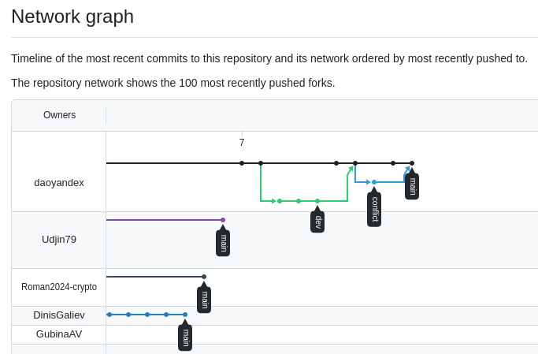

# Домашнее задание к занятию "`Занятие 8-01 Git`" - `Алексеев АВ`


### Инструкция по выполнению домашнего задания

   1. Сделайте `fork` данного репозитория к себе в Github и переименуйте его по названию или номеру занятия, например, https://github.com/имя-вашего-репозитория/git-hw или  https://github.com/имя-вашего-репозитория/7-1-ansible-hw).
   2. Выполните клонирование данного репозитория к себе на ПК с помощью команды `git clone`.
   3. Выполните домашнее задание и заполните у себя локально этот файл README.md:
      - впишите вверху название занятия и вашу фамилию и имя
      - в каждом задании добавьте решение в требуемом виде (текст/код/скриншоты/ссылка)
      - для корректного добавления скриншотов воспользуйтесь [инструкцией "Как вставить скриншот в шаблон с решением](https://github.com/netology-code/sys-pattern-homework/blob/main/screen-instruction.md)
      - при оформлении используйте возможности языка разметки md (коротко об этом можно посмотреть в [инструкции  по MarkDown](https://github.com/netology-code/sys-pattern-homework/blob/main/md-instruction.md))
   4. После завершения работы над домашним заданием сделайте коммит (`git commit -m "comment"`) и отправьте его на Github (`git push origin`);
   5. Для проверки домашнего задания преподавателем в личном кабинете прикрепите и отправьте ссылку на решение в виде md-файла в вашем Github.
   6. Любые вопросы по выполнению заданий спрашивайте в чате учебной группы и/или в разделе “Вопросы по заданию” в личном кабинете.
   
Желаем успехов в выполнении домашнего задания!
   
### Дополнительные материалы, которые могут быть полезны для выполнения задания

1. [Руководство по оформлению Markdown файлов](https://gist.github.com/Jekins/2bf2d0638163f1294637#Code)

---

### Задание 1

`Приведите ответ в свободной форме........`

##### 3: after git clone 
```bash
user@debian:~$ git clone git@github.com:daoyandex/Homework-8-01-Git.git
Клонирование в «Homework-8-01-Git»...
remote: Enumerating objects: 76, done.
remote: Counting objects: 100% (3/3), done.
remote: Compressing objects: 100% (3/3), done.
remote: Total 76 (delta 0), reused 2 (delta 0), pack-reused 73
Получение объектов: 100% (76/76), 3.59 МиБ | 2.17 МиБ/с, готово.
Определение изменений: 100% (27/27), готово.
user@debian:~$ 
```
##### 6: after clone
```bash
user@debian:~/HW-8-01-Git$ git status
Текущая ветка: main
Эта ветка соответствует «origin/main».

нечего коммитить, нет изменений в рабочем каталоге
user@debian:~/HW-8-01-Git$ 
```
##### 7, 8: after first modifies README.md
```bash
user@debian:~/HW-8-01-Git$ git status
Текущая ветка: main
Эта ветка соответствует «origin/main».

Изменения, которые не в индексе для коммита:
  (используйте «git add <файл>...», чтобы добавить файл в индекс)
  (используйте «git restore <файл>...», чтобы отменить изменения в рабочем каталоге)
        изменено:      README.md

индекс пуст (используйте «git add» и/или «git commit -a»)
user@debian:~/HW-8-01-Git$  
```
##### 9: after diff
```bash
user@debian:~/HW-8-01-Git$ git diff
diff --git a/README.md b/README.md
index 86ab73c..47d858d 100644
--- a/README.md
+++ b/README.md
@@ -1,4 +1,4 @@
-# Домашнее задание к занятию "`Git`" - `Алексеев АВ`
+# Домашнее задание к занятию "`Занятие 8-01 Git`" - `Алексеев АВ`
 
 
 ### Инструкция по выполнению домашнего задания
user@debian:~/HW-8-01-Git$ git diff --staged
user@debian:~/HW-8-01-Git$  
```
##### 10: after staging README.md
```bash
user@debian:~/HW-8-01-Git$ git add README.md
user@debian:~/HW-8-01-Git$ git status
Текущая ветка: main
Эта ветка соответствует «origin/main».

Изменения, которые будут включены в коммит:
  (используйте «git restore --staged <файл>...», чтобы убрать из индекса)
        изменено:      README.md

user@debian:~/HW-8-01-Git$ 
```
##### 11: results of diff & diff --staged
```bash
user@debian:~/HW-8-01-Git$ git diff
user@debian:~/HW-8-01-Git$ git diff --staged
diff --git a/README.md b/README.md
index 86ab73c..47d858d 100644
--- a/README.md
+++ b/README.md
@@ -1,4 +1,4 @@
-# Домашнее задание к занятию "`Git`" - `Алексеев АВ`
+# Домашнее задание к занятию "`Занятие 8-01 Git`" - `Алексеев АВ`
 
 
 ### Инструкция по выполнению домашнего задания
user@debian:~/HW-8-01-Git$  
```
##### 12. after first commit
```bash
user@debian:~/HW-8-01-Git$ git commit -m 'First commit'
[main a689def] First commit
 1 file changed, 1 insertion(+), 1 deletion(-)

user@debian:~/HW-8-01-Git$ git status 
Текущая ветка: main
Ваша ветка опережает «origin/main» на 1 коммит.
  (используйте «git push», чтобы опубликовать ваши локальные коммиты)

нечего коммитить, нет изменений в рабочем каталоге
user@debian:~/HW-8-01-Git$ 
```
##### 13. after push to origin/main
```bash
user@debian:~/HW-8-01-Git$ git push origin main
Перечисление объектов: 5, готово.
Подсчет объектов: 100% (5/5), готово.
При сжатии изменений используется до 8 потоков
Сжатие объектов: 100% (3/3), готово.
Запись объектов: 100% (3/3), 401 байт | 401.00 КиБ/с, готово.
Всего 3 (изменений 1), повторно использовано 0 (изменений 0), повторно использовано пакетов 0
remote: Resolving deltas: 100% (1/1), completed with 1 local object.
To github.com:daoyandex/Homework-8-01-Git.git
   16f5317..a689def  main -> main

user@debian:~/HW-8-01-Git$ git status 
Текущая ветка: main
Эта ветка соответствует «origin/main».

нечего коммитить, нет изменений в рабочем каталоге
user@debian:~/HW-8-01-Git$ 
```
---

### Задание 2

#### 1: after creating .gitignore
```bash
user@debian:~/HW-8-01-Git$ git status
Текущая ветка: main
Эта ветка соответствует «origin/main».

Неотслеживаемые файлы:
  (используйте «git add <файл>...», чтобы добавить в то, что будет включено в коммит)
        .gitignore

индекс пуст, но есть неотслеживаемые файлы
(используйте «git add», чтобы проиндексировать их)
user@debian:~/HW-8-01-Git$ 
```
#### 2: after staging .gitignore & it's further modification
```bash
user@debian:~/HW-8-01-Git$ git add .gitignore 
user@debian:~/HW-8-01-Git$ git status 
Текущая ветка: main
Эта ветка соответствует «origin/main».

Изменения, которые будут включены в коммит:
  (используйте «git restore --staged <файл>...», чтобы убрать из индекса)
        новый файл:    .gitignore

Изменения, которые не в индексе для коммита:
  (используйте «git add <файл>...», чтобы добавить файл в индекс)
  (используйте «git restore <файл>...», чтобы отменить изменения в рабочем каталоге)
        изменено:      .gitignore

user@debian:~/HW-8-01-Git$ git add .gitignore

user@debian:~/HW-8-01-Git$ git status 
Текущая ветка: main
Эта ветка соответствует «origin/main».

Изменения, которые будут включены в коммит:
  (используйте «git restore --staged <файл>...», чтобы убрать из индекса)
        новый файл:    .gitignore

user@debian:~/HW-8-01-Git$ 
```

#### 4: after commit & push
```bash
user@debian:~/HW-8-01-Git$ git commit -m ".gitignore created & modified"
[main 1541074] .gitignore created & modified
 1 file changed, 2 insertions(+)
 create mode 100644 .gitignore
user@debian:~/HW-8-01-Git$ git status 
Текущая ветка: main
Ваша ветка опережает «origin/main» на 1 коммит.
  (используйте «git push», чтобы опубликовать ваши локальные коммиты)

нечего коммитить, нет изменений в рабочем каталоге
user@debian:~/HW-8-01-Git$ git push origin main 
Перечисление объектов: 4, готово.
Подсчет объектов: 100% (4/4), готово.
При сжатии изменений используется до 8 потоков
Сжатие объектов: 100% (2/2), готово.
Запись объектов: 100% (3/3), 296 байтов | 296.00 КиБ/с, готово.
Всего 3 (изменений 1), повторно использовано 0 (изменений 0), повторно использовано пакетов 0
remote: Resolving deltas: 100% (1/1), completed with 1 local object.
To github.com:daoyandex/Homework-8-01-Git.git
   a689def..1541074  main -> main
user@debian:~/HW-8-01-Git$ 

```

---

### Задание 3

#### 1: after creating new branch & checkout to it
```bash
user@debian:~/HW-8-01-Git$ git checkout -b dev
Переключились на новую ветку «dev»

user@debian:~/HW-8-01-Git$ git status 
Текущая ветка: dev
нечего коммитить, нет изменений в рабочем каталоге

user@debian:~/HW-8-01-Git$ 
```

#### 2: after test.sh file creation
```bash
user@debian:~/HW-8-01-Git$ git status 
Текущая ветка: dev
Неотслеживаемые файлы:
  (используйте «git add <файл>...», чтобы добавить в то, что будет включено в коммит)
        test.sh

индекс пуст, но есть неотслеживаемые файлы
(используйте «git add», чтобы проиндексировать их)

user@debian:~/HW-8-01-Git$ 
```
#### 3: after a few commits and pushes to the dev branch
```bash
user@debian:~/HW-8-01-Git$ git log --oneline 
0416ada (HEAD -> dev, origin/dev) file test.sh is modified with third string echo
a87ddfa file test.sh is modified with second string echo
12d7cd2 file test.sh is created
1541074 (origin/main, origin/HEAD, main) .gitignore created & modified
a689def First commit
```
#### 4: after switch to the main branch
```bash
user@debian:~/HW-8-01-Git$ git checkout main 
Переключились на ветку «main»
Эта ветка соответствует «origin/main».
user@debian:~/HW-8-01-Git$
```
#### 5,6,7,8: after all steps
```bash
user@debian:~/HW-8-01-Git$ git checkout main 
Переключились на ветку «main»
Эта ветка соответствует «origin/main».

user@debian:~/HW-8-01-Git$ nano main.sh

user@debian:~/HW-8-01-Git$ git add main.sh 

user@debian:~/HW-8-01-Git$ git commit -m "File main.sh added in the main branch (after three commits in the dev branch)" 
[main 3561142] File main.sh added in the main branch (after three commits in the dev branch)
 1 file changed, 3 insertions(+)
 create mode 100644 main.sh
user@debian:~/HW-8-01-Git$ git push origin main
Перечисление объектов: 4, готово.
Подсчет объектов: 100% (4/4), готово.
При сжатии изменений используется до 8 потоков
Сжатие объектов: 100% (3/3), готово.
Запись объектов: 100% (3/3), 357 байтов | 357.00 КиБ/с, готово.
Всего 3 (изменений 1), повторно использовано 0 (изменений 0), повторно использовано пакетов 0
remote: Resolving deltas: 100% (1/1), completed with 1 local object.
To github.com:daoyandex/Homework-8-01-Git.git
   1541074..3561142  main -> main

user@debian:~/HW-8-01-Git$ git merge dev
Merge made by the 'ort' strategy.
 test.sh | 6 ++++++
 1 file changed, 6 insertions(+)
 create mode 100644 test.sh

user@debian:~/HW-8-01-Git$ git push origin main
Перечисление объектов: 4, готово.
Подсчет объектов: 100% (4/4), готово.
При сжатии изменений используется до 8 потоков
Сжатие объектов: 100% (2/2), готово.
Запись объектов: 100% (2/2), 342 байта | 342.00 КиБ/с, готово.
Всего 2 (изменений 1), повторно использовано 0 (изменений 0), повторно использовано пакетов 0
remote: Resolving deltas: 100% (1/1), completed with 1 local object.
To github.com:daoyandex/Homework-8-01-Git.git
   3561142..e264996  main -> main

user@debian:~/HW-8-01-Git$
```
### Задание 4

#### 1: Создайте ветку conflict и переключитесь на неё.
```bash
user@debian:~/HW-8-01-Git$ git checkout -b conflict
Переключились на новую ветку «conflict»
```
#### 2: Внесите изменения в файл test.sh.
```bash
user@debian:~/HW-8-01-Git$ nano test.sh 
```
#### 3: Сделайте коммит и пуш.
```bash
user@debian:~/HW-8-01-Git$ git add test.sh 

user@debian:~/HW-8-01-Git$ git commit -m "File test.sh has been modified in the conflict branch"
[conflict 43b1950] File test.sh has been modified in the conflict branch
 1 file changed, 1 insertion(+)

user@debian:~/HW-8-01-Git$ git push origin conflict
Перечисление объектов: 5, готово.
Подсчет объектов: 100% (5/5), готово.
При сжатии изменений используется до 8 потоков
Сжатие объектов: 100% (3/3), готово.
Запись объектов: 100% (3/3), 366 байтов | 366.00 КиБ/с, готово.
Всего 3 (изменений 2), повторно использовано 0 (изменений 0), повторно использовано пакетов 0
remote: Resolving deltas: 100% (2/2), completed with 2 local objects.
remote: 
remote: Create a pull request for 'conflict' on GitHub by visiting:
remote:      https://github.com/daoyandex/Homework-8-01-Git/pull/new/conflict
remote: 
To github.com:daoyandex/Homework-8-01-Git.git
 * [new branch]      conflict -> conflict
```
#### 4: Переключитесь на основную ветку.
```bash
user@debian:~/HW-8-01-Git$ git checkout main 
Переключились на ветку «main»
Эта ветка соответствует «origin/main».
```
#### 5: Измените ту же самую строчку в файле test.sh.
```bash
user@debian:~/HW-8-01-Git$ nano test.sh 
```
#### 6: Сделайте коммит и пуш.
```bash
user@debian:~/HW-8-01-Git$ git add test.sh 

user@debian:~/HW-8-01-Git$ git commit -m "File test.sh has beem modified in the same string like at the conflict branch"
[main 382b5c4] File test.sh has beem modified in the same string like at the conflict branch
 1 file changed, 1 insertion(+)

user@debian:~/HW-8-01-Git$ git push origin main 
Перечисление объектов: 5, готово.
Подсчет объектов: 100% (5/5), готово.
При сжатии изменений используется до 8 потоков
Сжатие объектов: 100% (3/3), готово.
Запись объектов: 100% (3/3), 365 байтов | 365.00 КиБ/с, готово.
Всего 3 (изменений 2), повторно использовано 0 (изменений 0), повторно использовано пакетов 0
remote: Resolving deltas: 100% (2/2), completed with 2 local objects.
To github.com:daoyandex/Homework-8-01-Git.git
   e264996..382b5c4  main -> main
```
#### 7: Сделайте мердж ветки conflict в основную ветку и решите конфликт так, чтобы в результате в файле оказался код из ветки conflict.
```bash
user@debian:~/HW-8-01-Git$ git merge conflict 
Автослияние test.sh
КОНФЛИКТ (содержимое): Конфликт слияния в test.sh
Сбой автоматического слияния; исправьте конфликты, затем зафиксируйте результат.

user@debian:~/HW-8-01-Git$ git status 
Текущая ветка: main
Эта ветка соответствует «origin/main».

У вас есть не слитые пути.
  (разрешите конфликты, затем запустите «git commit»)
  (используйте «git merge --abort», чтобы остановить операцию слияния)

Не слитые пути:
  (используйте «git add <файл>...», чтобы пометить разрешение конфликта)
        оба изменены:   test.sh

индекс пуст (используйте «git add» и/или «git commit -a»)

user@debian:~/HW-8-01-Git$ git add test.sh 

user@debian:~/HW-8-01-Git$ git commit -m "Commit after merging conflict branch into main branch (string in the test.sh file remained from conflict branch)"
[main a2bd6bb] Commit after merging conflict branch into main branch (string in the test.sh file remained from conflict branch)

user@debian:~/HW-8-01-Git$ git push origin main 
Перечисление объектов: 1, готово.
Подсчет объектов: 100% (1/1), готово.
Запись объектов: 100% (1/1), 268 байтов | 268.00 КиБ/с, готово.
Всего 1 (изменений 0), повторно использовано 0 (изменений 0), повторно использовано пакетов 0
To github.com:daoyandex/Homework-8-01-Git.git
   382b5c4..a2bd6bb  main -> main

user@debian:~/HW-8-01-Git$ 
```

